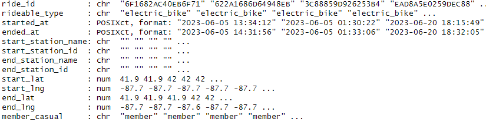
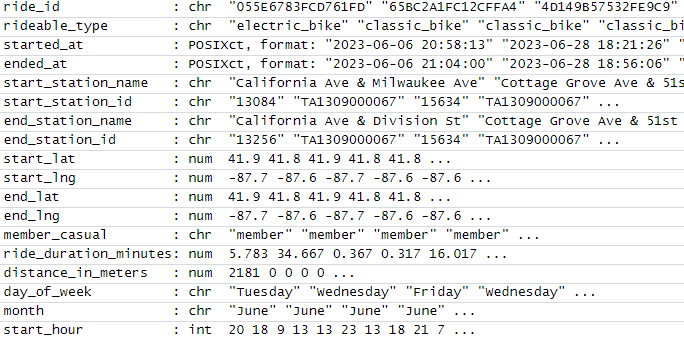
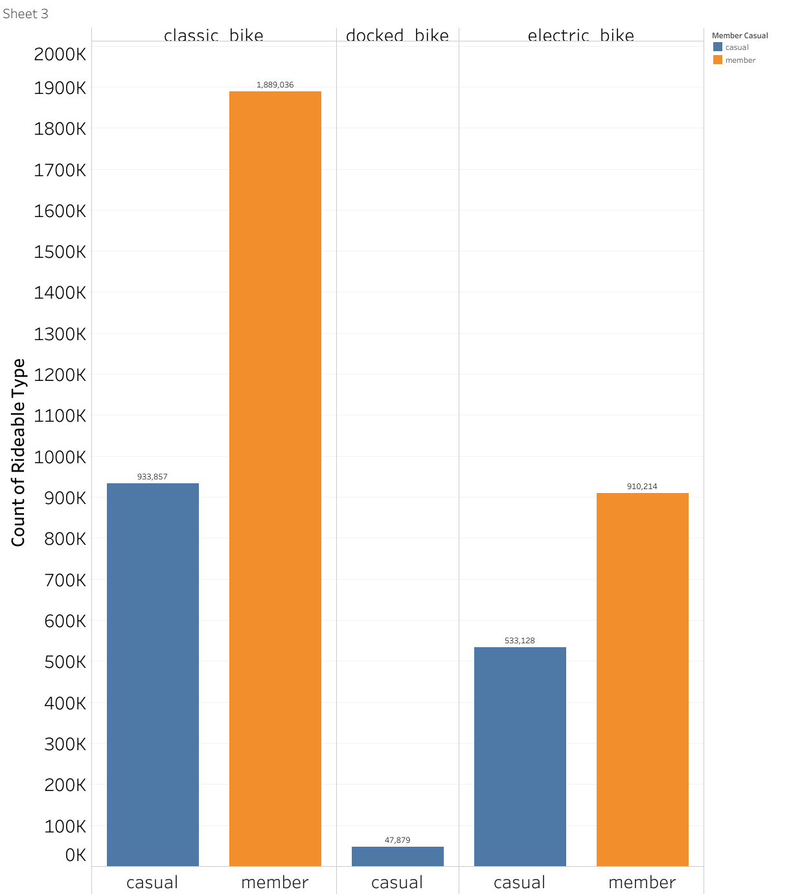

# Google-Capstone-Project
## About Cyclistic
In 2016, Cyclistic launched a successful bike-share offering. Since then, the program has grown
to a fleet of 5,824 bicycles that are geotracked and locked into a network of 692 stations
across Chicago. The bikes can be unlocked from one station and returned to any other station
in the system anytime.

Until now, Cyclistic’s marketing strategy relied on building general awareness and appealing to
broad consumer segments. One approach that helped make these things possible was the
flexibility of its pricing plans: single-ride passes, full-day passes, and annual memberships.
Customers who purchase single-ride or full-day passes are referred to as casual riders.
Customers who purchase annual memberships are Cyclistic members.

Cyclistic’s finance analysts have concluded that annual members are much more profitable
than casual riders. Although the pricing flexibility helps Cyclistic attract more customers,
Moreno believes that maximizing the number of annual members will be key to future growth.
Rather than creating a marketing campaign that targets all-new customers, Moreno believes
there is a solid opportunity to convert casual riders into members. She notes that casual riders
are already aware of the Cyclistic program and have chosen Cyclistic for their mobility needs.

## Introduction
The dataset used in this analysis is from [Here](https://divvy-tripdata.s3.amazonaws.com/index.html) under this  [Data License Agreement](https://divvybikes.com/data-license-agreement) and is for learning purposes. as Cyclistic is a fictional company. For this analysis, we'll be using the datasets made available from June 2023 till June 2024. The purpose of this analysis is to identify possible insights and patterns in the dataset provided by the company that would help with decision-making.

## Ask
Three questions will guide the future marketing program:​
  1. How do annual members and casual riders use Cyclistic bikes differently? ​
  2. Why would casual riders buy Cyclistic annual memberships? ​
  3. How can Cyclistic use digital media to influence casual riders to become members? ​

We will address the first question mostly in this analysis.

## Prepare and Process
Tools Used:​

  1. R Programming Language(For Data Wrangling and Analysis)​
  2. Tableau (For Data Visualization)​

We have 12 datasets each covering a month from June 2023 till June 2024 and their formatted as shown below. 

### Data Combining
We used the rbindlist to bind all 12 datasets into one. As seen in [here](Analysis.R) and below.
<pre>
June2023 <- fread("202306-divvy-tripdata.csv", na.strings = "")
July2023 <- fread("202307-divvy-tripdata.csv", na.strings = "")
August2023 <- fread("202308-divvy-tripdata.csv", na.strings = "")
September2023 <- fread("202309-divvy-tripdata.csv", na.strings = "")
October2023 <- fread("202310-divvy-tripdata.csv", na.strings = "")
November2023 <- fread("202311-divvy-tripdata.csv", na.strings = "")
December2023 <- fread("202312-divvy-tripdata.csv", na.strings = "")
January2024<- fread("202401-divvy-tripdata.csv", na.strings = "")
February2024 <- fread("202402-divvy-tripdata.csv", na.strings = "")
March2024 <- fread("202403-divvy-tripdata.csv", na.strings = "")
April2024 <- fread("202404-divvy-tripdata.csv", na.strings = "")
May2024 <- fread("202405-divvy-tripdata.csv", na.strings = "")

combined_data <- rbindlist(list(
  June2023, July2023, August2023, September2023,
  October2023, November2023, December2023, January2024,
  February2024, March2024, April2024, May2024
))
</pre>
na.strings = "" converts all the empty values to NULL value.
The newly made dataset has 5743278 rows. 

### Data Cleaning
No duplicate rows were present in the datasets.    
There was a total of **7684** null values present in "**end_lat**" and "**end_lng**" which all were removed from the dataset.    
There was a total of **956579** null values present in **end_station_name** and **end_station_id** all of which were removed from the dataset.    
There was a total of **905237** null values present in **start_station_name** and **start_station_id** all of which were removed from the dataset.        
There was a total of **72** rides in which the start time was either bigger than or equal to the end time all of which were removed from the dataset.   

After the cleaning process the dataset has 4314114 rows. 

### Data Enriching
We added five columns to our datasets as shown in [R script](Analysis.R) to help with the analysis process. 
  1. The month in which the ride started
  2. The day of the week in which the ride started.
  3. The hour of the day in which the ride started.
  4. The duration of the ride in minutes.
  5. The distance of the ride in meters.

After adding the new columns the format of the dataset is shown below.

### Data Exploration

There are **1514864** rides taken by casual riders and there are **2799250** rides taken by members. 

The average ride duration for casuals is **23.58741 minutes**   
The average ride duration for members is **12.42971 minutes**
An average casual ride lasts almost twice as long as a member ride. 

The average ride distance for casuals is **2123.006 meters**   
The average ride distance for members is **2058.034 meters**
On average casual rides are a bit longer in distance than member rides.

## Analysis and Visualization
The cleaned dataset is written to a new csv file and is used in Tableau for visualization

below is the chart for number of rides based on memebership type and rideable type.

We can see that the number of rides taken by members is much higher for classic bikes and electric bikes however members don't use docked bikes.   
Docked bikes are only used by casual riders. 
